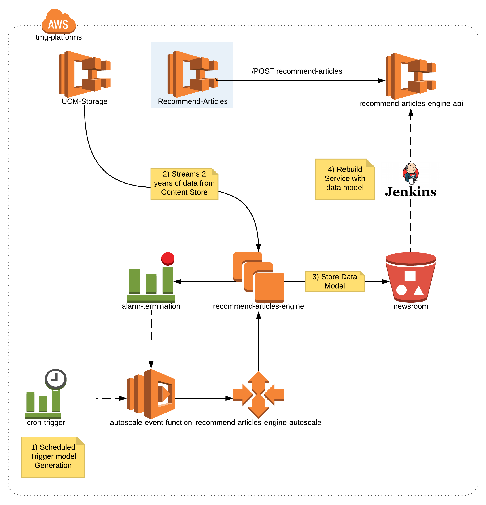

# Recommend Articles Service

The Newsroom project is changing the way we produce content at Telegraph. One of the most important pieces of this 
project is our **Recommend Articles** engine which allow us to reference and link upcoming content with live content.

The **Recommend Articles** relies on Machine Learning to generate article recommendations. In the first approach, the 
algorithm will recommend articles based on the article's body.

In terms of structure, this project is composed by:
 * **Recommend Articles Engine** - code that trains and generates the data model to be used to recommend articles;
 * **Recommend Articles Engine API** - service that uses the data model to recommend articles;
 * **Recommend Articles API** - service that acts like a Facade and returns the recommend articles details;


## Description
The **Recommend Article Engine API** service makes use of the *data-frame* and *data-model*
generated by our **Recommend Article Engine**. This minimalistic micro-service is responsible 
for returning the *content-id* of the recommended articles given a specific article body. 


## Architecture
The following image depicts the architectural components used in this module:



## Rest API
Because this service exposes a Rest API, a Swagger definition is used to self document the service ([Swagger.yaml](https://raw.githubusercontent.com/telegraph/platforms-swagger-specs/master/newsroom/recommend-articles-engine-api.yaml))

#### GET /health & GET /recommend-articles/health
This endpoint should be used by the load balancer to check if the service is up. 

##### Request
```
GET /recommend-articles/health
```

##### Response
```
StatusCode: 200
Content-Type: application/json
Payload:
{
    "status": "OK"
}
```

#### GET /recommend-articles/health/detailed 
This endpoint is used to get the service detailed health status. It contains information about all service dependencies 
and their connectivity. This status is cached in the service for a minute. Therefore, the *cached=true* query parameter
can be used to get a fresh status.

##### Request
```
GET /recommend-articles/health/detailed?cached=true
```

##### Response
```
StatusCode: 200
Content-Type: application/json
Payload:
{
    "name": "recommend-articles",
    "version": "1.0.0-b30",
    "status": "Healthy",
    "cached": false,
    "clients": [
        {
            "name": "Recommender Client",
            "status": 200,
            "date-time": 1525948481,
            "date-time-str": "2018-05-10T10:34:41.548+00:00",
            "configs": {
                "health.method": "GET",
                "health.path": "/health",
                "baseUrl": "http://alb.api-platforms.telegraph.co.uk/recommend-articles-engine-api"
            },
            "command": "curl  -X GET http://alb.api-platforms.telegraph.co.uk/recommend-articles-engine-api/health -v"
        },
        {
            "name": "UCM Storage Client",
            "status": 200,
            "date-time": 1525948481,
            "date-time-str": "2018-05-10T10:34:41.549+00:00",
            "configs": {
                "health.method": "GET",
                "health.path": "/health",
                "baseUrl": "http://alb.api-platforms.telegraph.co.uk/ucm-storage-service"
            },
            "command": "curl  -X GET http://alb.api-platforms.telegraph.co.uk/ucm-storage-service/health -v"
        }
    ]
} 
```


#### GET /recommend-articles/swagger
This endpoint returns the Swagger documentation for this Service.


#### POST /recommend-articles/by-article
Get Article recommendations based on an Article. The body contains the following properties

| Name                    | Type            | Required | Description |
|:-----------------------:|:---------------:|:--------:| -----------:|
| sort                    | String          | No       | The sort order for the recommendations results. -/+ can be used for ascending or descending order (Default: -score) |
| limit                   | Number          | No       | The offset index to return recommendations from this point onwards (up to the limit specified) (Default: 5) |
| offset                  | Number          | No       | The sort order for the recommendations results. -/+ can be used for ascending or descending order (Default: 0) |
| query-filters.source    | Array of String | No       | An array of sources that the recommended content must be from |
| query-filters.date-from | String          | No       | Only content after this date should be returned | 
| query-filters.date-to   | String          | No       | Only content before this date should be returned | 
| query-filters.channel   | Array of String | No       | An Array of Channel names. Only content from these channels should be returned. | 
| query-object.headline   | String          | No       | Headline of the article (plain text), may get a higher weighting than body text. | 
| query-object.channel    | String          | No       | The channel name which the article belongs to, maybe taken in to account by the recommender algorithm | 
| query-object.body       | String          | Yes      | The body of the article (plain text) | 

 

##### Request
```
POST /recommend-article-engine/article
Content-Type: 'application/json' 
Payload:
{
    "sort" : "-score",
    "limit" : 20,
    "offset" : 0,
    "query-object" : {
        "headline" : "Iran deal",
        "channel" : "news",
        "body" : "Britain and France are leading the nuclear deal with Iran."
    }
}
```

##### Response Success
```
StatusCode: 200
Content-Type: 'application/json' 
Payload:
{
    "result-count": 20,
    "data": [
        {
            "id": "c610485f-65ee-3c85-bee9-3602ab70449b",
            "score": 0.6404775381,
            "type": "article",
            "headline": "Iran 'may quit nuclear deal' if Donald Trump sabotages benefits of sanctions relief, minister warns",
            "url": "http://www.telegraph.co.uk/news/2018/02/22/iran-may-quit-nuclear-deal-donald-trump-sabotages-benefits-sanctions/",
            "thumbnail": "https://www.telegraph.co.uk/content/dam/films/2018/02/20/TELEMMGLPICT000154766062_trans%2B%2BpVlberWd9EgFPZtcLiMQfyf2A9a6I9YchsjMeADBa08.jpeg",
            "pubdate": "2018-02-22T14:20:56.173Z",
            "source": "AEM",
            "authors": [
                "Roland Oliphant",
                "Emma Gatten"
            ]
        },
        ...
    ]
}
```

##### Response Failure
```
StatusCode: 500
Content-Type: 'application/json' 
Payload:
{
    "status": {
        "statusCode": 400,
        "appErrorCode": 1000,
        "message": "requirement failed: Invalid field - 'query-object.body' length must be greater than 50"
    }
}
```
